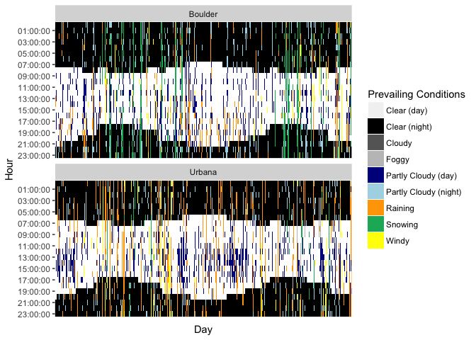
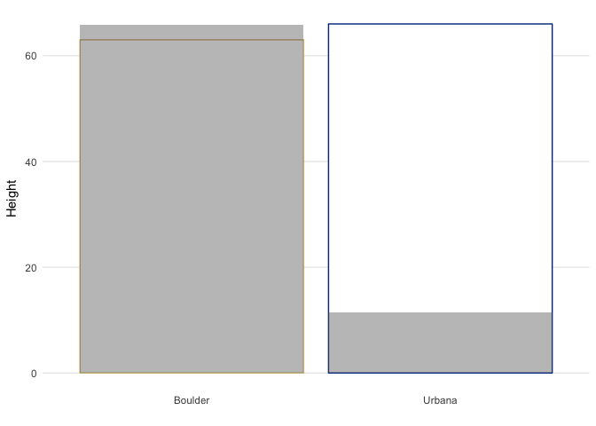
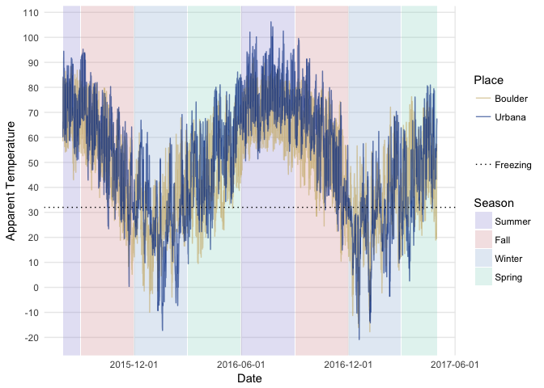

Two Sisters, One Dark Sky
================

My younger sister and I both left our home state two years ago, her for undergrad, me for grad school. It was a big move for both of us, particularly weather-wise. We were leaving northern California, land of 1.5 seasons, for Colorado and Illinois, where it *snows*. What a notion.

I thought it might make a fun little project to explore the weather we've both experienced in the past two years. How similar was it? How different? And most importantly, who suffers worse?

Retrieving the Data
===================

Here's the code I used to get the data originally, using \[@hrbrmstr\](<https://twitter.com/hrbrmstr>)'s super handy Dark Sky API wrapper for R. I retrieved the hourly forecast for both places, starting on August 1st, 2015 (about the time we moved) up to May 1st, 2017. Latitude and longitude I retrieved manually via Google Maps, centered on the main buildings for our respective departments (Music for her, Psychology for me).

``` r
suppressPackageStartupMessages({
  library(darksky)
  library(dplyr)
  library(data.table)
  library(tidyr)
  library(ggplot2)})

time_period <- seq.Date(as.Date("2015-08-02"), as.Date("2017-05-01"), by='days')
unix_time <- sapply(time_period, function(date) as.numeric(as.POSIXct(date)))

all_requests <- data.frame('place'=rep(c('Boulder', 'Urbana'), each=length(unix_time)),
                           'lat'=rep(c(40.006034, 40.107699), each=length(unix_time)),
                           'lon'=rep(c(-105.269079, -88.229944), each=length(unix_time)),
                           'time'=rep(unix_time, 2))
```

This code would read in all requests at once. Since there's a cap on the number of free API calls one can make in a day, I actually did this in two chunks; one for Boulder, one for Urbana.

``` r
all_weather <- mapply(get_forecast_for, 
                      all_requests$lat, all_requests$lon, as.integer(all_requests$time))
all_weather <- rbindlist(all_weather[1,], fill=T)
all_weather$place <- all_requests$place
```

To save having to get the data more than once, I saved it to a .csv and just read it in locally.

I'll do a little bit of clean-up and slight reformatting to make the data maximally easy to work with. I'll split the `time` column into `day` and `hour` columns as well, and then arrange the data by place, day, and then hour.

``` r
weather <- rbindlist(list('Boulder'=read.csv('boulder.csv', row.names=NULL),
                              'Urbana'=read.csv('urbana.csv', row.names=NULL)), 
                         idcol='place', fill=TRUE) %>%
                separate(time, c('day', 'hour'), sep=' ', remove=FALSE) %>%
                arrange(place, day, hour) %>%
                mutate('time'=as.POSIXct(time))

seasons <- data.frame('start'=as.POSIXct(c('2015-8-1', '2015-9-1', '2015-12-1',
                                           '2016-3-1', '2016-6-1', '2016-9-1',
                                           '2016-12-1','2017-3-1')), 
                      'end'=as.POSIXct(c('2015-8-31', '2015-11-30', '2016-2-29',
                                         '2016-5-31', '2016-8-31', '2016-11-30',
                                         '2017-2-28', '2017-5-1')), 
                      'season'=c('Summer', 'Fall', 'Winter', 'Spring', 'Summer', 
                                 'Fall', 'Winter','Spring')) %>%
                      mutate(season=factor(season, levels=c('Summer', 'Fall', 'Winter', 'Spring'),
                                            ordered=TRUE))
```

And here's a peek at the data:

``` r
knitr::kable(head(weather))
```

| place   | time                | day        | hour     | summary | icon        |  precipIntensity|  precipProbability|  temperature|  apparentTemperature|  dewPoint|  humidity|  windSpeed|  windBearing|  visibility|  cloudCover|  pressure| precipType |  precipAccumulation|
|:--------|:--------------------|:-----------|:---------|:--------|:------------|----------------:|------------------:|------------:|--------------------:|---------:|---------:|----------:|------------:|-----------:|-----------:|---------:|:-----------|-------------------:|
| Boulder | 2015-08-01 01:00:00 | 2015-08-01 | 01:00:00 | Clear   | clear-night |                0|                  0|        64.98|                64.98|     49.19|      0.57|       5.64|          186|       10.00|        0.06|   1016.60| NA         |                  NA|
| Boulder | 2015-08-01 02:00:00 | 2015-08-01 | 02:00:00 | Clear   | clear-night |                0|                  0|        61.97|                61.97|     49.81|      0.64|       2.31|          235|        9.69|        0.03|   1016.17| NA         |                  NA|
| Boulder | 2015-08-01 03:00:00 | 2015-08-01 | 03:00:00 | Clear   | clear-night |                0|                  0|        62.38|                62.38|     48.84|      0.61|       2.71|          205|       10.00|        0.03|   1015.50| NA         |                  NA|
| Boulder | 2015-08-01 04:00:00 | 2015-08-01 | 04:00:00 | Clear   | clear-night |                0|                  0|        61.98|                61.98|     49.11|      0.63|       1.62|          191|        9.69|        0.03|   1014.96| NA         |                  NA|
| Boulder | 2015-08-01 05:00:00 | 2015-08-01 | 05:00:00 | Clear   | clear-night |                0|                  0|        59.58|                59.58|     49.03|      0.68|       1.98|          183|       10.00|        0.03|   1014.90| NA         |                  NA|
| Boulder | 2015-08-01 06:00:00 | 2015-08-01 | 06:00:00 | Clear   | clear-night |                0|                  0|        59.62|                59.62|     50.22|      0.71|       2.19|          164|        9.69|        0.03|   1014.64| NA         |                  NA|

The API actually gives you three things: the `currently` forecast, a `daily` forecast, and the `hourly` forecasts. I wanted hourly for this.

We also get a bunch of variables to explore.

Rain or Shine
=============

The `icon` variable in this dataset is a short description of prevailing weather conditions (the "worst" weather to occur that hour). I'm going to put the day on the x-axis and the hour on the y-axis, and then in each little grid color it according to the data at that hour. This will create a mosaic of weather patterns across time.

``` r
tiles <- ggplot(data=weather) +
  geom_raster(aes(x=day, y=hour, fill=icon)) +
  facet_wrap(~place, nrow=2) +
  scale_fill_manual(values=c('Clear (day)'='#FFFFFF', 'clear-night'='#000000',
                             'cloudy'='#666666','fog'='#c1c1c1',
                             'partly-cloudy-day'='darkblue', 'partly-cloudy-night'='lightblue',
                             'rain'='orange','snow'='#13b268', 'wind'='yellow'),
                    labels=c('Clear (day)', 'Clear (night)', 'Cloudy', 'Foggy', 
                             'Partly Cloudy (day)', 'Partly Cloudy (night)', 'Raining', 
                             'Snowing', 'Windy')) +
  scale_y_discrete(limits=rev(levels(as.factor(weather$hour))), 
                   breaks=rev(levels(as.factor(weather$hour)))[seq(1, 24, by=2)]) +
  ylab('Hour') +
  xlab('Day') +
  labs(fill='Prevailing Conditions') +
  theme(axis.text.x=element_blank(),
        axis.ticks.x=element_blank())

print(tiles)
```



We both get about the same amount of clear hours. My plot has a lot more blue, orange, and yellow--clouds, rain, and wind--while little sister's has a lot more green (snow), although she also gets a lot of cloudy nights. This also reveals the changing daylight hours as the year progresses, which is kind of neat. You can see them get longer and shorter as the seasons change.

Up to your neck (cumulatively)
==============================

Speaking of snow, I want to examine how much we each get. Instead of just plotting raw inches, I'm going to create a new variable: percent of our respective heights in snowfall we got. I'm also going to convert to daily snowfall, instead of hourly.

``` r
snowheight <- mutate(weather, height=ifelse(place=='Boulder', 63, 66), 
                     snow=ifelse(is.na(precipAccumulation), 0, precipAccumulation)) %>%
                     group_by(place, height, day) %>%
                     summarize(snowheight=sum(snow)) %>%
                     mutate(pct=100*(snowheight/height), day=as.POSIXct(day))

snow_plot <- ggplot() +
  geom_rect(data=seasons, aes(xmin=start, xmax=end,
                ymin=0, ymax=Inf, fill=season), alpha=.3) +
  scale_fill_manual(values=c('#a7a2db','#dba2a7','#a2bddb','#a2dbcd')) +
  geom_line(data=snowheight, aes(x=day, y=pct, color=place)) +
  scale_color_manual(values=c('#CFB87C','#00368e'), breaks=NULL) +
  scale_x_datetime(breaks=seasons$start[-1]) +
  ylab("Percent of Sister's Height") +
  xlab('') +
  theme(panel.grid.minor=element_blank(),
        panel.background=element_blank(),
        panel.grid.major.y=element_line(color='lightgray'),
        panel.grid.major.x=element_blank(),
        axis.text.x=element_text(angle=295, hjust=0)) +
  facet_wrap(~place)

print(snow_plot)
```


Okay, little sister definitely had it worse than I did in terms of snowfall.

What happens if we stack up all the snow each of us got? If we were to pile it up, how much of each of us would it cover?

``` r
total_snow <- ggplot(data=group_by(snowheight, place, height) %>%
                       summarize(snowheight=sum(snowheight))) +
  geom_col(aes(x=place, y=height, color=place), fill='white') +
  geom_col(aes(x=place, y=snowheight), alpha=.4) +
  theme_minimal() +
  scale_color_manual(values=c('#CFB87C','#00368e')) +
  theme(panel.grid.minor=element_blank(),
        panel.grid.major.x=element_blank(),
        legend.position='none') +
  ylab('Height') +
  xlab('')

print(total_snow)
```



Little sister is buried! Her snow would go over her head, but all of my snow doesn't even reach my knees. For reference, Boulder averages about 89 inches of snow a year, while Urbana averages about 21.

Alright, so I lose privileges re: complaining about snow. But there are two other formitable climate characteristics to bear in mind: wind chill (in winter) and humidity (in summer).

For the wind, I'll plot hourly wind speed on the y-axis and time on the x-axis.

``` r
wind <- ggplot() +
  geom_rect(data=seasons, aes(xmin=start, xmax=end,
                ymin=0, ymax=Inf, fill=season), alpha=.3) +
  scale_fill_manual(values=c('#a7a2db','#dba2a7','#a2bddb','#a2dbcd')) +
  geom_line(data=weather, aes(x=time, y=windSpeed, color=place), alpha=.6) +
  labs(color='Place', fill='Season') +
  scale_color_manual(values=c('#CFB87C','#00368e')) +
  scale_x_datetime(date_breaks='3 months') +
  theme_minimal() +
  ylab('Wind Speed') +
  xlab('Date')

print(wind)
```


It's much windier in Urbana--not a lot of overlap in these plots. It is worth noting that the winds pick up in Urbana during the winter and early spring months (green and blue), aka the worst possible time for them to do so.

I can do the same type of plot for humidity.

``` r
humidity <- ggplot() +
  geom_rect(data=seasons, aes(xmin=start, xmax=end,
                ymin=0, ymax=Inf, fill=season), alpha=.3) +
  scale_fill_manual(values=c('#a7a2db','#dba2a7','#a2bddb','#a2dbcd')) +
  geom_line(data=weather, aes(x=time, y=humidity, color=place), alpha=.6) +
  scale_x_datetime(date_breaks='3 months') +
  scale_color_manual(values=c('#CFB87C','#00368e')) +
  theme_minimal() +
  labs(color='Place') +
  ylab('Humidity (%)') +
  xlab('Date')

print(humidity)
```


No contest. Urbana is more humid, hands-down. By quite a lot, too, especially in late summer (when humidity's misery-inducing powers are at their peak).

Taking Temperature
==================

I'm going to plot the temperature progressions for the past two years on top of each other. I'm going to use the `apparentTemperature` variable, which factors in things like wind and humidity, rather than the raw temperature (wind chill in winter is no joke).

``` r
running_temps <- ggplot() +
  geom_rect(data=seasons, aes(xmin=start, xmax=end,
                ymin=-Inf, ymax=Inf, fill=season), alpha=.3) +
  scale_fill_manual(values=c('#a7a2db','#dba2a7','#a2bddb','#a2dbcd')) +
  geom_line(data=weather, aes(x=time, y=apparentTemperature, color=place), alpha=.6) +
  ylab('Apparent Temperature') +
  xlab('Date') +
  scale_color_manual(values=c('#CFB87C','#00368e')) +
  scale_x_datetime(date_breaks="6 months") +
  scale_y_continuous(breaks=seq(-30, 110, by=10)) +
  geom_hline(aes(yintercept=32, linetype='Freezing')) +
  scale_linetype_manual(values='dotted') +
  labs(color='Place', linetype=NULL, fill='Season') +
  theme_minimal() +
  theme(panel.grid.minor=element_blank())

print(running_temps)
```



Let the record reflect that Urbana suffers worse extremes, both for cold and heat (but particularly heat).

How do the differences between the two places look? I'll subtract Boulder's temperature from Urbana's and plot it over time, breaking it apart by year to get a better look.

``` r
#positive=Urbana warmer, negative=boulder warmer
td <- group_by(weather, day, hour) %>%
      mutate(diff_t=temperature[2] - temperature[1],
             diff_f=apparentTemperature[2] - apparentTemperature[1],
             year=strsplit(day, '-')[[1]][1])
diff_plot <- ggplot(data=td, aes(x=time, y=diff_f, color=diff_f)) +
  geom_line() +
  ylim(-60, 60) +
  facet_wrap(~year, nrow=3, scales='free_x') +
  scale_color_gradient(low='blue', high='red', limits=c(-60, 60)) +
  scale_x_datetime(date_breaks="1 month", date_labels=('%m')) +
  ylab('') +
  xlab('Month') +
  labs(color='Urbana - Boulder') +
  theme_minimal() +
  theme(panel.grid.minor=element_blank())

print(diff_plot)
```


Our climates are fairly similar during the summer, although Urbana runs hotter overall. Things vary pretty wildly in the winter and spring, though, with positive *and* negative differences of up to almost 60 degrees at some points!

So there you have it. Urbana is wetter, hotter, and windier; Boulder is snowier. To butcher Tolstoy, all temperate climates are alike; all intemperate climates are intemperate in their own way.

------------------------------------------------------------------------

[Powered by Dark Sky](https://darksky.net/poweredby/)
